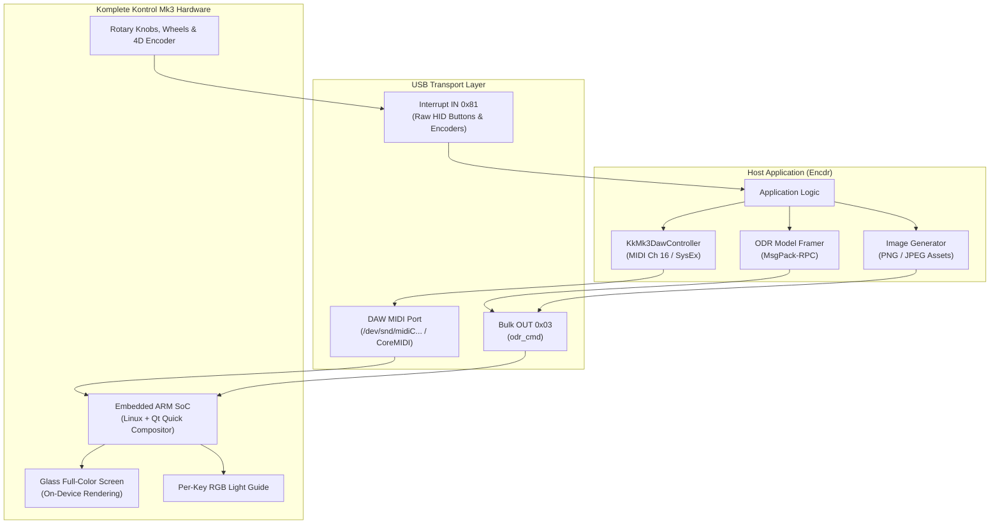

# Komplete Kontrol S-Series Mk3 Guide: DAW & On-Device Rendering (ODR)

This guide documents the full capabilities, hardware architecture, and API integration for the **Native Instruments Komplete Kontrol S-Series Mk3** (S49, S61, and S88) keyboards within [`encdr`](file:///home/rufus/Documents/Projects/Encdr/encdr/src/lib.rs).

---

## 1. Overview & Architecture

The Komplete Kontrol S-Series Mk3 introduces a fundamentally different architecture compared to previous Native Instruments controllers (such as the Maschine Mk3, Maschine Studio, or Traktor Kontrol S8/S5/D2):

- **Embedded Linux SoC**: The keyboard contains an onboard dual-core ARM System-on-Chip (SoC) executing an embedded Linux operating system and a local Qt Quick / QML rendering engine.
- **Glass Full-Color Display**: UI rendering occurs locally on the keyboard's embedded GPU.
- **Dual-Channel Host Communication**:
  1. **Direct DAW Remote Port** (`"KONTROL S-Series MK3 DAW"`): Standard MIDI Channel 16 Control Changes and SysEx packets for transport, mixer channels, stereo dB VU meters, 14-bit rotary knob resolution, and text readouts.
  2. **USB Bulk Endpoint (ODR)** (`odr_cmd` on Bulk OUT `0x03`): A high-speed MessagePack-RPC command pipe driving typed UI data models (parameter banks, plugin chains, preset browsers, mixer cards, Smart Play scales/arps, and binary image asset caches).
- **Physical Controls**: Anodized aluminum touch-sensitive continuous rotary encoders, 4D directional encoder, polyphonic aftertouch keybed, pitch and modulation wheels, multi-touch expression strip, and per-key 24-bit RGB Light Guide LEDs.



---

## 2. Hardware Capabilities: What Mk3 CAN and CANNOT Do

Understanding the boundaries of the S-Series Mk3 is critical when designing your application:

### What the Mk3 CAN Do

| Capability | Mechanism | Description |
| :--- | :--- | :--- |
| **Direct DAW Remote Control** | MIDI Ch 16 + SysEx | Full bidirectional mixer and transport control without proprietary services. |
| **High-Res 14-bit Knobs** | SysEx `0x7F` | Smooth, high-precision knob delta tracking decoded with sub-millimeter precision. |
| **8-Track Stereo VU Meters** | SysEx `0x49` | Logarithmic 7-bit dB meters (`-70.0 dB` to `+6.0 dB`) updating simultaneously for 8 channels. |
| **On-Device Parameter Pages** | ODR MsgPack-RPC | 8 rotary parameter controls per page with 8 widget styles, labels, formatted readouts, and section groupings. |
| **Real-Time Value Modulation** | ODR `update_parameter_value` | Zero-overhead scalar updates without resending the entire parameter tree. |
| **Graphical Header Banners** | ODR `register_asset` | PNG and JPEG images uploaded into onboard flash cache for full-width instrument banners. |
| **Dynamic Host Image Upload** | ODR `set_header_image` | Host-rendered raster buffers (e.g. waveforms, envelopes, custom badges) pushed into the banner cache. |
| **Serial Plugin Chains** | ODR `set_plugin_chain` | Multi-plugin insert list with custom slot names, vendor labels, bypass states, and focus selection. |
| **ODR Mixer Views** | ODR `set_mixer_model` | Onboard mixer cards with volume, pan, mute, solo, arm, and stereo metering. |
| **Smart Play Scales & Arps** | ODR `set_smartplay` | Scale types, root keys, chord sets, and arpeggiator engine configurations. |
| **Sound & Preset Browser** | ODR `set_browser_model` | Hierarchical sound browser with multiple category columns and preset selection lists. |
| **View Page Switching** | ODR `set_page` | Instant navigation between onboard templates (`Parameters`, `Browser`, `Mixer`, `SmartPlay`, `PluginChain`, `Settings`). |
| **24-bit RGB Light Guide** | ODR `set_lightguide` | Individual 24-bit RGB color control for every key across 49, 61, or 88-key keybeds. |
| **Hardware Device Settings** | ODR `set_device_settings` | Programmatic display backlight brightness, button LED brightness, and velocity response. |

### What the Mk3 CANNOT Do

- **No Raw 60 FPS Framebuffer Streaming Over USB**: Unlike older NI hardware (Maschine Mk3, Maschine Studio, Traktor Kontrol S8/S5/D2) which accept continuous raw RGB565 / BGR565 video framebuffers from host graphics engines (like `encdr-view`), the Mk3 does **not** expose a raw display endpoint. Its display is driven by an onboard GPU compositor running Qt Quick QML. Screen updates must be sent as typed state models or static/cached image banners.
- **No Arbitrary QML Script Upload Over USB**: The QML UI views and page layouts are pre-compiled and reside inside the keyboard's onboard Linux firmware filesystem. You cannot upload arbitrary `.qml` source files over USB to inject custom QML components.
- **No Firmware-Bypass Sleep Screen Animation**: Keyboard standby and sleep dimming are managed internally by the device firmware. You can adjust the display backlight brightness via [`DeviceSettings`](file:///home/rufus/Documents/Projects/Encdr/encdr/src/device/komplete_kontrol/odr/models.rs#L461-L477), but you cannot replace the sleep screen with an active video feed.
- **No Audio Interface Streaming**: Encdr is strictly a control surface and display driver framework. Audio input and output are handled natively by your OS audio subsystem (ALSA/PipeWire on Linux, CoreAudio on macOS, ASIO/WASAPI on Windows).

---

## 3. Connecting to the Keyboard

The Komplete Kontrol Mk3 requires two communication handles:
1. **USB Interface Claim (Encdr)**: Connects to the raw USB device via `nusb` to send ODR MsgPack-RPC packets over Bulk OUT `0x03` (`odr_cmd`) and receive button/encoder HID reports.
2. **DAW Remote MIDI Port**: Opens the dedicated MIDI port (`"KONTROL S-Series MK3 DAW"`) for Channel 16 CCs and SysEx.

```rust
use encdr::{Encdr, EncdrConfig, DeviceId, KkMk3DawController};

let mut encdr = Encdr::new(EncdrConfig::default())?;
let devices = encdr.scan()?;

// Find the connected Komplete Kontrol Mk3 device
let mk3_id = devices.into_iter().find(|id| {
    if let Some(desc) = encdr.descriptor(*id) {
        desc.name.contains("Komplete Kontrol S") && desc.name.contains("Mk3")
    } else {
        false
    }
}).expect("No Komplete Kontrol Mk3 keyboard detected");

println!("Connected to Mk3 on USB: {:?}", mk3_id);

// Initialize DAW Remote controller
let daw = KkMk3DawController::new();
```

---

## 4. DAW Remote Control Guide (MIDI CC & SysEx)

The DAW Remote port operates on **MIDI Channel 16** (Status byte `0xBF`) and uses universal SysEx manufacturer header `F0 00 21 09 00 00 44 43 01 00 ... F7`.

### 4.1 Handshake & Session Initialization

On application startup, send the handshake sequence to switch the keyboard into DAW integration mode and enable high-resolution 14-bit rotary knob tracking:

```rust
// 1. Hello handshake (DAW protocol v4)
let hello = daw.build_hello(); // [0xBF, 0x01, 0x04]
// Send `hello` to the DAW MIDI OUT port...

// 2. Enable 14-bit high-resolution SysEx rotary knob updates
let enable_14bit = daw.build_enable_14bit(); // [0xBF, 0x06, 0x01]
// Send `enable_14bit` to the DAW MIDI OUT port...

// 3. Register your host application name
let identity = daw.build_identity("My DAW Host", 1, 0);
// Send `identity` to the DAW MIDI OUT port...

// 4. Set vertical track orientation
let config = daw.build_surface_configuration_vertical();
// Send `config` to the DAW MIDI OUT port...
```

On exit, send the goodbye message to restore standalone state:

```rust
let goodbye = daw.build_goodbye(); // [0xBF, 0x02, 0x00]
// Send `goodbye` to the DAW MIDI OUT port...
```

### 4.2 Configuring Track Strips & VU Meters

Configure track names, selection states, solo/mute/arm status, colors, and live stereo VU meters across the 8 channel strips:

```rust
// Set track names
let name_msg = daw.build_track_name(0, "Lead Synth");
let color_msg = daw.build_track_color_rgba(0, 0.0, 0.8, 1.0, 1.0); // Cyan #FF00CCFF
let selected_msg = daw.build_track_selected(0, true);
let armed_msg = daw.build_track_armed(0, true);

// Formatted volume and pan readouts
let vol_msg = daw.build_volume_display(0, "-3.5 dB");
let pan_msg = daw.build_pan_display(0, "L 15");

// 8-channel stereo VU meters (-70.0 dB to +6.0 dB, f32::NEG_INFINITY for silence)
let left_levels = [-6.0, -12.0, -18.0, -24.0, f32::NEG_INFINITY, -3.0, -9.0, -15.0];
let right_levels = [-6.0, -12.0, -18.0, -24.0, f32::NEG_INFINITY, -3.0, -9.0, -15.0];
let vu_msg = daw.build_vu_meters(&left_levels, &right_levels);
```

### 4.3 Parsing Incoming DAW Remote Events

Incoming MIDI packets from Channel 16 are parsed via [`KkMk3DawController::parse_incoming`](file:///home/rufus/Documents/Projects/Encdr/encdr/src/device/komplete_kontrol/daw.rs#L302-L350):

```rust
use encdr::{KkMk3DawController, KkMk3DawEvent};

let incoming_midi_bytes: &[u8] = /* received from MIDI IN */;

if let Some(event) = daw.parse_incoming(incoming_midi_bytes) {
    match event {
        KkMk3DawEvent::Button { name, pressed, .. } => {
            println!("DAW Button: {} (pressed: {})", name, pressed);
        }
        KkMk3DawEvent::Navigation { name, delta, .. } => {
            println!("Navigation {}: relative delta {}", name, delta);
        }
        KkMk3DawEvent::KnobAdjustment14Bit { group, index, delta } => {
            println!("14-bit Knob [{:?}] slot #{}: delta {:+.4}", group, index, delta);
        }
        KkMk3DawEvent::BankMapping(mode) => {
            println!("Bank mapping switched: {:?}", mode);
        }
        KkMk3DawEvent::SelectedTrackVolumeDelta(delta) => {
            println!("Volume fine delta: {}", delta);
        }
        KkMk3DawEvent::SelectedTrackPanDelta(delta) => {
            println!("Pan fine delta: {}", delta);
        }
        KkMk3DawEvent::PluginSelected { chain_index } => {
            println!("Plugin slot focused: #{}", chain_index);
        }
        KkMk3DawEvent::TempoChangeBpm(bpm) => {
            println!("Hardware requested BPM change: {:.1}", bpm);
        }
        KkMk3DawEvent::OtherSysEx(_) => {}
    }
}
```

---

## 5. On-Device Rendering (ODR) Guide

ODR communication uses MessagePack-RPC envelopes transmitted over the Mk3's USB Bulk OUT endpoint (`0x03`). High-level helper methods on [`Encdr`](file:///home/rufus/Documents/Projects/Encdr/encdr/src/lib.rs#L44-L50) format, frame, and dispatch these packets automatically.

### 5.1 Designing Parameter Pages

Build an 8-knob parameter page using [`PluginData`](file:///home/rufus/Documents/Projects/Encdr/encdr/src/device/komplete_kontrol/odr/models.rs#L130-L172) and [`ParameterItem`](file:///home/rufus/Documents/Projects/Encdr/encdr/src/device/komplete_kontrol/odr/models.rs#L78-L125).

#### Available Widget Display Types

| Widget Type | Enum Variant | Visual Appearance |
| :--- | :--- | :--- |
| **Knob** | [`WidgetDisplayType::Knob`](file:///home/rufus/Documents/Projects/Encdr/encdr/src/device/komplete_kontrol/odr/models.rs#L60) | Radial circular arc gauge. |
| **Range** | [`WidgetDisplayType::Range`](file:///home/rufus/Documents/Projects/Encdr/encdr/src/device/komplete_kontrol/odr/models.rs#L62) | Linear continuous slider bar. |
| **Toggle** | [`WidgetDisplayType::Toggle`](file:///home/rufus/Documents/Projects/Encdr/encdr/src/device/komplete_kontrol/odr/models.rs#L64) | 2-state On/Off switch button. |
| **Trigger** | [`WidgetDisplayType::Trigger`](file:///home/rufus/Documents/Projects/Encdr/encdr/src/device/komplete_kontrol/odr/models.rs#L66) | Momentary action / strike button. |
| **Increment** | [`WidgetDisplayType::Increment`](file:///home/rufus/Documents/Projects/Encdr/encdr/src/device/komplete_kontrol/odr/models.rs#L68) | Discrete stepped selector (e.g. shapes, octaves). |
| **Relative** | [`WidgetDisplayType::Relative`](file:///home/rufus/Documents/Projects/Encdr/encdr/src/device/komplete_kontrol/odr/models.rs#L70) | Bipolar center-detented indicator (`-1.0` to `+1.0`). |
| **Text** | [`WidgetDisplayType::Text`](file:///home/rufus/Documents/Projects/Encdr/encdr/src/device/komplete_kontrol/odr/models.rs#L72) | Static text label readout. |
| **Disabled** | [`WidgetDisplayType::Disabled`](file:///home/rufus/Documents/Projects/Encdr/encdr/src/device/komplete_kontrol/odr/models.rs#L74) | Empty knob slot. |

#### Building and Sending a Page

```rust
use encdr::{ParameterItem, PluginData, RgbColor, WidgetDisplayType};

let mut plugin = PluginData::new("Analog Monolith", RgbColor::CYAN);

// Add up to 8 parameters mapped to the physical encoders
plugin.add_parameter(ParameterItem::knob("Cutoff", 0.72, "3.4 kHz", "Filter"));
plugin.add_parameter(ParameterItem::knob("Resonance", 0.45, "45%", "Filter"));
plugin.add_parameter(ParameterItem::knob("Drive", 0.20, "+3.0 dB", "Filter"));
plugin.add_parameter(ParameterItem::toggle("Lowpass 24", true, "Filter"));

plugin.add_parameter(ParameterItem::knob("Attack", 0.15, "12 ms", "Envelope"));
plugin.add_parameter(ParameterItem::knob("Decay", 0.50, "320 ms", "Envelope"));
plugin.add_parameter(ParameterItem::knob("Sustain", 0.80, "-2.0 dB", "Envelope"));
plugin.add_parameter(ParameterItem::knob("Release", 0.35, "180 ms", "Envelope"));

// Dispatch to the keyboard
encdr.kk_mk3_set_plugin_data(mk3_id, &plugin)?;
```

### 5.2 Real-Time Parameter Value Updates

When a knob is turned or an LFO modulates a parameter, update the scalar value directly without re-transmitting the entire model tree:

```rust
// Modulate Cutoff (Knob #0) to 0.85
encdr.kk_mk3_update_parameter_value(mk3_id, 0, 0.85)?;
```

---

## 6. Graphical Header Banners & Image Generation

The top area of the Mk3's glass display renders a full-width header banner. You can display pre-rendered PNG/JPEG images or generate custom graphics on the host.

### 6.1 Registering and Displaying an Image Asset

Image assets are registered into the keyboard's onboard cache under an arbitrary asset ID string:

```rust
// Read a pre-rendered PNG banner from disk
let banner_png = std::fs::read("assets/synth_banner.png")?;

// 1. Register the asset in cache
encdr.kk_mk3_register_asset(mk3_id, "my_synth_banner", &banner_png)?;

// 2. Attach the asset ID to the plugin model
plugin.background = Some("my_synth_banner".to_string());
encdr.kk_mk3_set_plugin_data(mk3_id, &plugin)?;
```

Or use the convenience helper [`kk_mk3_set_header_image`](file:///home/rufus/Documents/Projects/Encdr/encdr/src/lib.rs#L515-L525) to perform both operations in one call:

```rust
encdr.kk_mk3_set_header_image(mk3_id, "my_synth_banner", &banner_png, &mut plugin)?;
```

### 6.2 Host-Side Dynamic Image Generation

You can dynamically render banners on the host (e.g. using the `image` crate, a software rasterizer, or canvas renderer) and encode them to PNG in memory before uploading:

```rust
fn create_dynamic_banner(title: &str, accent_color: [u8; 3]) -> Vec<u8> {
    let width = 1200u32;
    let height = 240u32;
    let mut img = image::RgbImage::new(width, height);

    // Draw background gradient
    for (x, y, pixel) in img.enumerate_pixels_mut() {
        let t = x as f32 / width as f32;
        let r = (20.0 * (1.0 - t) + accent_color[0] as f32 * t * 0.4) as u8;
        let g = (20.0 * (1.0 - t) + accent_color[1] as f32 * t * 0.4) as u8;
        let b = (30.0 * (1.0 - t) + accent_color[2] as f32 * t * 0.4) as u8;
        *pixel = image::Rgb([r, g, b]);
    }

    // Encode to PNG bytes in memory
    let mut png_bytes = Vec::new();
    let encoder = image::codecs::png::PngEncoder::new(&mut png_bytes);
    image::ImageEncoder::write_image(
        encoder,
        img.as_raw(),
        width,
        height,
        image::ColorType::Rgb8.into(),
    ).expect("PNG encode failed");

    png_bytes
}

// Upload dynamic banner to the keyboard
let dynamic_png = create_dynamic_banner("Encdr Modular", [0, 210, 255]);
encdr.kk_mk3_set_header_image(mk3_id, "live_modular_banner", &dynamic_png, &mut plugin)?;
```

---

## 7. Extended ODR Models

### 7.1 Serial Plugin Chain

Display the track's serial insert chain (instruments and audio effects):

```rust
use encdr::{PluginChainModel, PluginChainItem, RgbColor};

let mut chain = PluginChainModel::new();
chain.add_plugin(PluginChainItem::new("Analog Monolith", RgbColor::CYAN).with_vendor("Encdr Audio"));
chain.add_plugin(PluginChainItem::new("Stereo Delay", RgbColor::GREEN).with_vendor("Encdr Audio"));
chain.add_plugin(PluginChainItem::new("Raum Reverb", RgbColor::BLUE).with_vendor("Native Instruments"));
chain.set_current_index(0); // Select first plugin

encdr.kk_mk3_set_plugin_chain(mk3_id, &chain)?;

// Change focused plugin index
encdr.kk_mk3_set_plugin_chain_index(mk3_id, 1)?;
```

### 7.2 ODR Mixer Model & Stereo VU Meters

Populate the onscreen multi-channel mixer:

```rust
use encdr::{MixerModel, MixerTrack, RgbColor};

let mut mixer = MixerModel::new();
let mut track1 = MixerTrack::new("Lead Synth", RgbColor::CYAN);
track1.volume = 0.85;
track1.volume_display = "-1.5 dB".into();
track1.pan = -0.2;
track1.pan_display = "L 20".into();

let track2 = MixerTrack::new("Drums", RgbColor::ORANGE);
mixer.add_track(track1);
mixer.add_track(track2);

encdr.kk_mk3_set_mixer_model(mk3_id, &mixer)?;

// Stream stereo VU meters (0.0 .. 1.0)
let left_meters = [0.75, 0.50];
let right_meters = [0.72, 0.48];
encdr.kk_mk3_set_mixer_meters(mk3_id, &left_meters, &right_meters)?;
```

### 7.3 Smart Play (Scales, Chords & Arpeggiator)

Configure the onboard Smart Play engine:

```rust
use encdr::SmartPlayData;

let mut smartplay = SmartPlayData::default();
smartplay.scale.enabled = true;
smartplay.scale.root_key = 2; // D
smartplay.scale.scale_type = "Dorian".into();

smartplay.arp.enabled = true;
smartplay.arp.pattern = "UpDown".into();
smartplay.arp.rate = "1/16".into();

smartplay.chord.enabled = true;
smartplay.chord.chord_type = "Octave".into();

encdr.kk_mk3_set_smartplay(mk3_id, &smartplay)?;
```

### 7.4 Sound & Preset Browser

Populate category filter tags and preset sound items in the browser view:

```rust
use encdr::{BrowserModel, BrowserFilter, BrowserSoundItem};

let mut browser = BrowserModel::default();

// Add category filter columns
browser.filters.push(
    BrowserFilter::new("Category", vec!["Synths".into(), "Bass".into(), "Pads".into()])
        .with_selection("Synths")
);
browser.filters.push(
    BrowserFilter::new("Sub-Category", vec!["Lead".into(), "Pluck".into(), "Sequence".into()])
        .with_selection("Lead")
);

// Add preset items
browser.sounds.push(BrowserSoundItem::new("Blade Runner Lead", "Encdr", "Analog Monolith"));
browser.sounds.push(BrowserSoundItem::new("Sub Zero Bass", "Encdr", "Analog Monolith"));
browser.selected_sound_index = Some(0);

encdr.kk_mk3_set_browser_model(mk3_id, &browser)?;
```

### 7.5 Hardware Device Settings

Adjust display backlight brightness, button LED brightness, and velocity response curve:

```rust
use encdr::DeviceSettings;

let mut settings = DeviceSettings::default();
settings.display_brightness = 90; // 0..100%
settings.led_brightness = 75;     // 0..100%
settings.velocity_curve = "Soft".into();

encdr.kk_mk3_set_device_settings(mk3_id, &settings)?;
```

### 7.6 Switching Screen Views

Switch the active view template on the keyboard display using [`kk_mk3_set_page`](file:///home/rufus/Documents/Projects/Encdr/encdr/src/lib.rs#L613-L623):

```rust
use encdr::KkMk3Page;

// Show parameter controls
encdr.kk_mk3_set_page(mk3_id, KkMk3Page::Parameters)?;

// Show preset browser
encdr.kk_mk3_set_page(mk3_id, KkMk3Page::Browser)?;

// Show mixer view
encdr.kk_mk3_set_page(mk3_id, KkMk3Page::Mixer)?;

// Show Smart Play view
encdr.kk_mk3_set_page(mk3_id, KkMk3Page::SmartPlay)?;

// Show device settings
encdr.kk_mk3_set_page(mk3_id, KkMk3Page::Settings)?;
```

---

## 8. 24-Bit RGB Keybed Light Guide

The per-key Light Guide LEDs are driven by passing a slice of `(r, g, b)` tuples to [`kk_mk3_set_lightguide`](file:///home/rufus/Documents/Projects/Encdr/encdr/src/lib.rs#L487-L496). The key count is 49 for S49, 61 for S61, and 88 for S88:

```rust
// Animate a rainbow sweep across 61 keys
let key_count = 61;
let mut keys = Vec::with_capacity(key_count);

let phase = 0.5f32; // animation phase
for i in 0..key_count {
    let hue = (i as f32 / key_count as f32 + phase) % 1.0;
    let (r, g, b) = hsv_to_rgb(hue, 1.0, 0.8);
    keys.push((r, g, b));
}

encdr.kk_mk3_set_lightguide(mk3_id, &keys)?;
```

---

## 9. Complete Working Example

See [`examples/komplete_kontrol/kk_mk3_daw_odr.rs`](file:///home/rufus/Documents/Projects/Encdr/examples/komplete_kontrol/kk_mk3_daw_odr.rs) for the complete reference application demonstrating:
- DAW remote greeting, 14-bit SysEx mode enable, track labeling, and VU meters.
- On-device parameter page construction with 8 widgets.
- Dynamic in-memory PNG banner generation and cache registration.
- Continuous 60 FPS Light Guide sweep animation and parameter LFO modulation.
- Serial plugin chain, browser, mixer, and device settings registration.

Run the example with:
```bash
cargo run -p encdr-examples --bin kk_mk3_daw_odr
```
